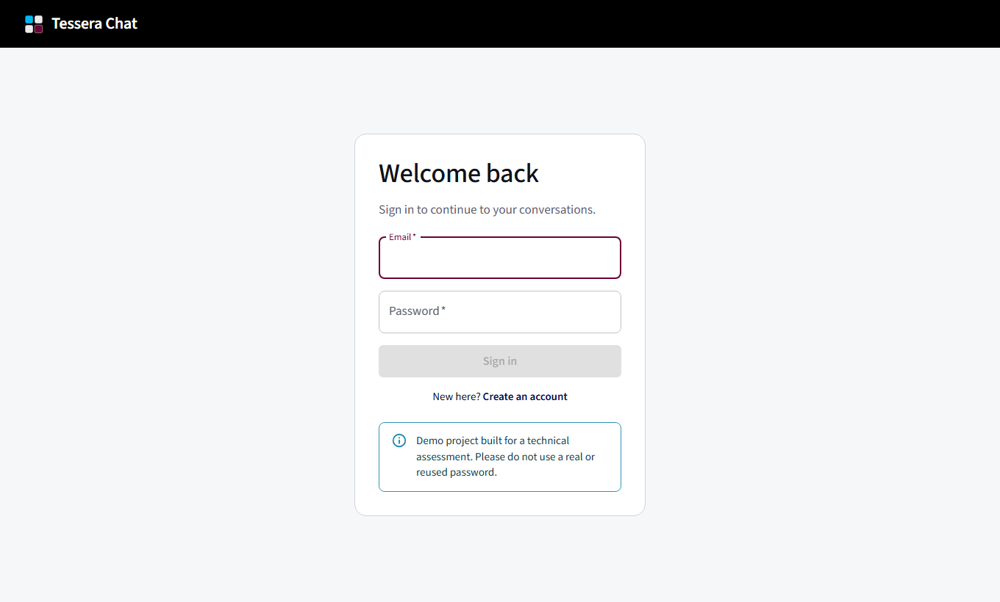
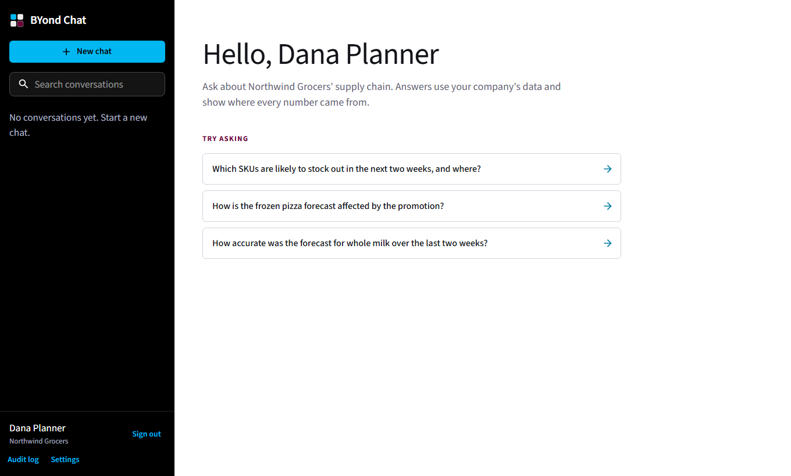
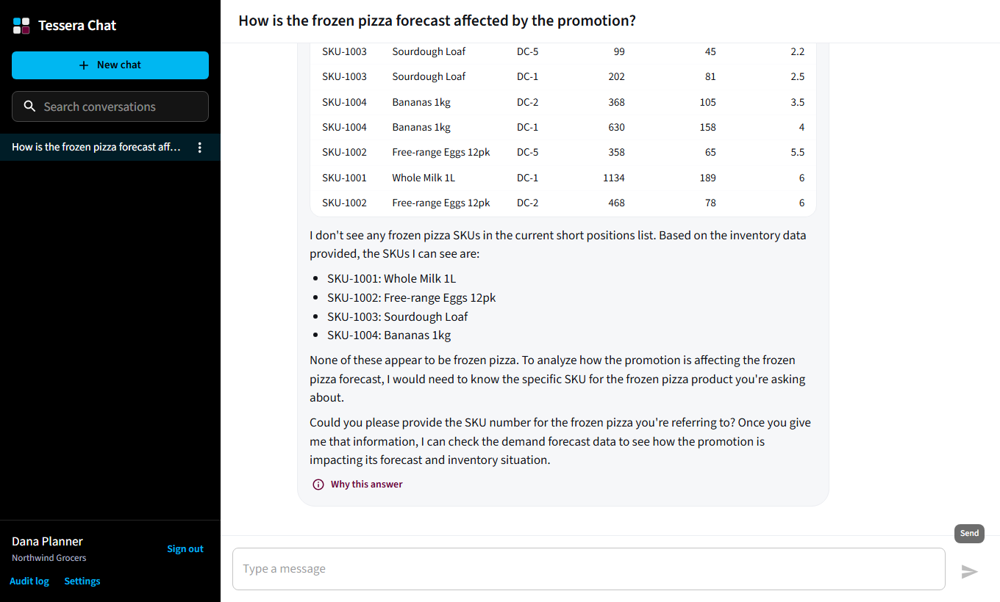
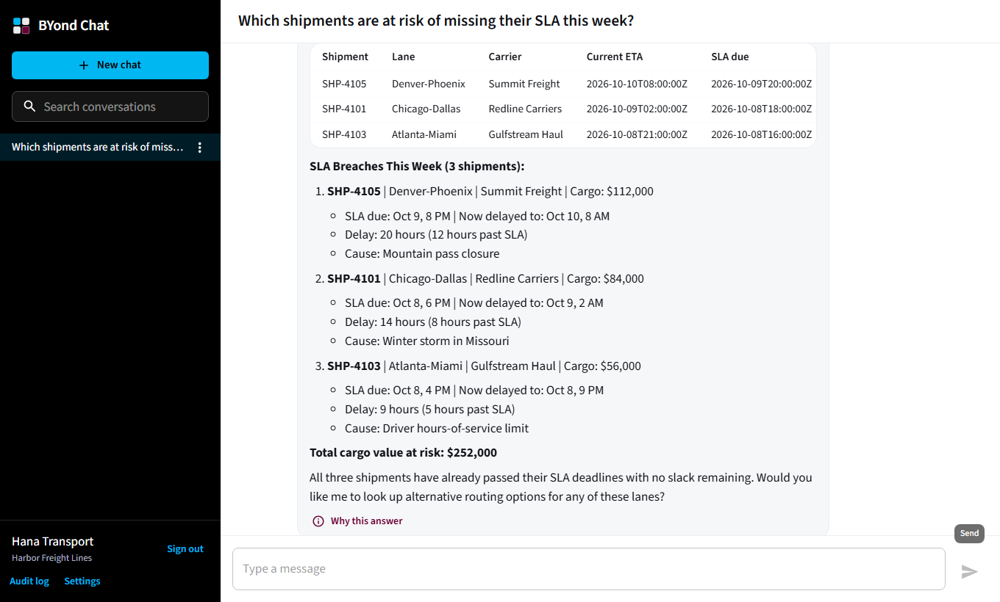
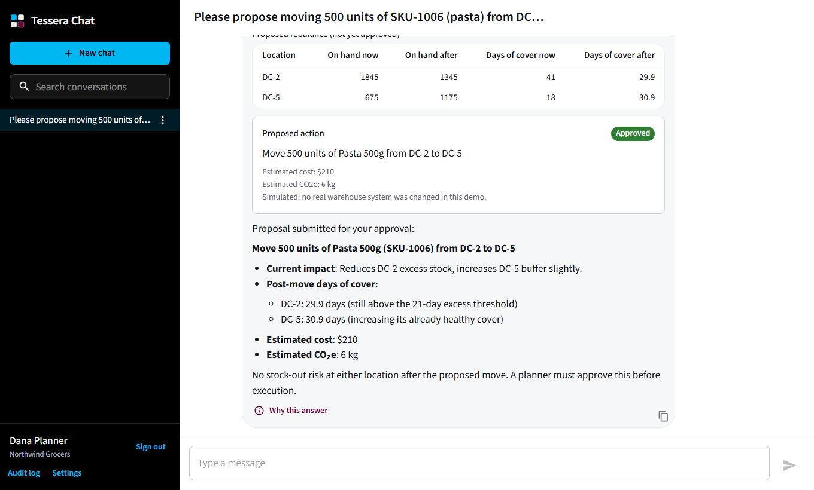
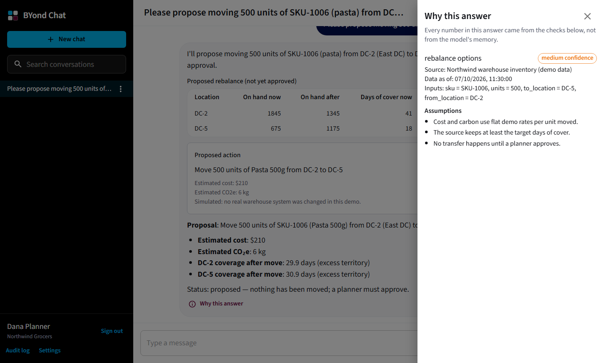
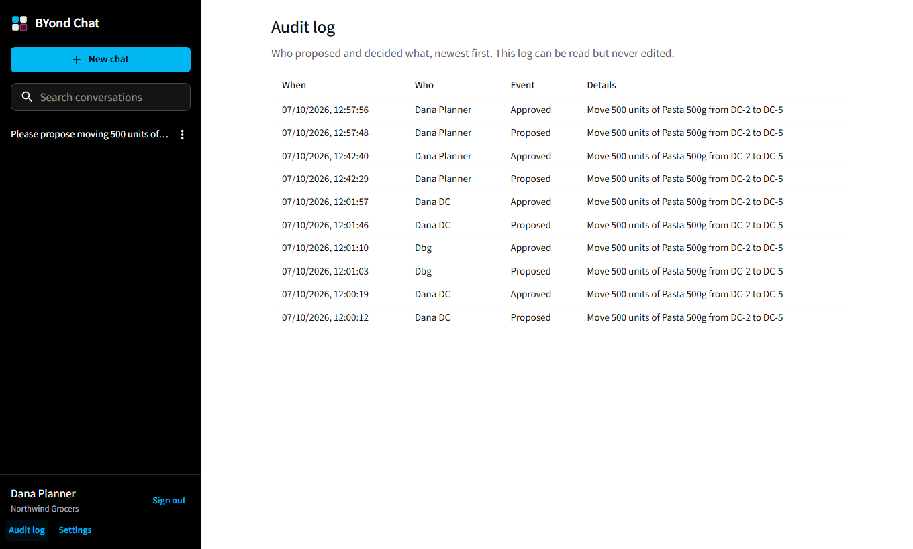

# BYond Chat

A full stack, ChatGPT-style conversational app with a **Supply Chain Copilot** layer: streaming answers from a real
language model, rich replies (Markdown, code, tables, charts, choice buttons), and tools that answer planners' questions
from their own company's data, with provenance, human approval and an audit trail.

Built for a technical assessment (FastAPI + PostgreSQL + React + Material UI). It is a demo, not a real service: please do
not use a real password.

**Live demo:** https://web-production-cb37f.up.railway.app (deployed on Railway from `main`)

| Sign in | Home with starter questions | Rich reply: table and chart |
|---|---|---|
|  |  |  |

| Copilot answering with tools | Approve a proposal | Why this answer | Audit log |
|---|---|---|---|
|  |  |  |  |

## Features

**Core (assignment requirements)**

- Messaging, conversations, users and settings (choose a persona); rename, delete and search conversations.
- RESTful API with a single error format, request ids and input validation.
- Authentication and persistence: Argon2id passwords, short-lived access tokens, rotating refresh tokens with reuse
  detection, PostgreSQL.
- **Streaming** responses over Server-Sent Events, with Stop, partial replies kept, and a retry button.
- **Rich content:** Markdown with syntax-highlighted code, tables, charts, images, lists.
- **Action buttons and choice menus**, including approval cards for proposed actions.

**Bonus features**

| Bonus | Status |
|---|---|
| Database migrations (Alembic, also verified on Postgres in CI) | Done |
| Docker containerization and Compose | Done |
| Charts and graphs | Done |
| Code syntax highlighting | Done |
| Markdown rendering | Done |
| Copy message | Done |
| Conversation history with search | Done (by title) |
| Dark mode, conversation export, Redis cache | Not built (see limitations) |

**Supply Chain Copilot (my addition for the role)**

- Two fictional companies (grocery retail, regional logistics) with isolated data; the company and role come from the
  database, never from the client.
- Personas (demand planner, DC manager, transportation planner) change the suggested questions and the assistant's focus.
- Five typed tools over fictional data; the model may only quote numbers that tools return, and every answer can show
  "Why this answer" (tools, inputs, data as-of time, confidence, assumptions).
- Proposals (for example "move 500 units of pasta from DC-2 to DC-5") must be approved by a person: role-checked,
  idempotent, re-validated, audited. The effect is simulated and labelled as such.

## Quick start with Docker

Needs Docker with Compose. No configuration required.

```bash
git clone https://github.com/nareshipme/chatgpt-clone.git
cd chatgpt-clone
docker compose up --build
```

Open http://localhost:3000, register, and try a starter question. Without a key the assistant uses the built-in **mock**
provider (it echoes your message and can show a table, chart and choices when you include `[table]`, `[chart]` or
`[choices]`, and exercises the tools with `[tool:list_at_risk_shipments]`).

### Use a real model

The app talks to any OpenAI-compatible API. OpenRouter's free models work well for a demo:

1. Create a key at https://openrouter.ai/keys.
2. `cp .env.example .env` and set:
   ```
   LLM_PROVIDER=openai_compatible
   LLM_API_KEY=sk-or-...
   LLM_MODEL=poolside/laguna-s-2.1:free
   ```
3. `docker compose up --build` again.

Check a model before relying on it: `LLM_API_KEY=... python backend/scripts/llm_check.py`. Free models are shared and
sometimes rate-limited; the API retries the same model with backoff and the UI offers Retry.

## Run without Docker

You need Python 3.11 or newer, Node 22 and (optionally) PostgreSQL. SQLite works for local development.

```bash
# backend
cd backend
python -m venv .venv && source .venv/bin/activate        # Windows: .venv\Scripts\activate
pip install -r requirements-dev.txt
export DATABASE_URL="sqlite+aiosqlite:///./dev.db" JWT_SECRET="any-long-random-string-0123456789abcdef" LLM_PROVIDER=mock
alembic upgrade head
uvicorn app.main:app --reload --port 8000

# frontend (second terminal)
cd frontend
npm install
npm run dev                                               # http://localhost:5173, proxies /api to :8000
```

## Configuration

All settings are environment variables (see `.env.example`).

| Variable | Purpose | Default |
|---|---|---|
| `DATABASE_URL` | Postgres or SQLite URL (`postgresql://` is converted for the async driver) | none |
| `JWT_SECRET` | Signs access tokens. **Required**: no default, the app fails loudly without it | none |
| `COOKIE_SECURE` | `true` in production so the refresh cookie is HTTPS-only | `false` |
| `LLM_PROVIDER` | `mock` (dev and tests only; refused when `COOKIE_SECURE=true`) or `openai_compatible` | `mock` |
| `LLM_API_KEY`, `LLM_BASE_URL`, `LLM_MODEL` | The model to call | OpenRouter, a free model |
| `LLM_MAX_RETRIES`, `LLM_MAX_TOOL_ROUNDS`, `LLM_REQUEST_TIMEOUT_S` | Resilience and bounds | 5, 6, 60 |
| `REDIS_URL` | Redis (health-checked; not yet used for caching) | none |
| `CORS_ORIGINS` | Allowed origins when the API is called cross-origin | localhost |
| `ACCESS_TOKEN_MINUTES`, `REFRESH_TOKEN_DAYS`, `ACTION_EXPIRY_MINUTES` | Lifetimes | 15, 7, 30 |

## Tests

```bash
cd backend && pytest -m "not live"        # about 250 tests; add the opt-in live test with LLM_API_KEY set
cd frontend && npm test                    # about 100 tests
cd frontend && npm run build               # type-check and production build
```

CI (GitHub Actions) runs both suites on every pull request and also applies the migrations up, down and up on a real
PostgreSQL service.

## A two-minute tour

1. Register and pick **Northwind Grocers** (or **Harbor Freight Lines**).
2. Click a starter question. Watch the "Checking: ..." chip, then a table or chart, then the summary stream in.
3. Open **Why this answer** under the reply.
4. In **Settings**, switch persona to **DC manager**, ask: "Please propose moving 500 units of SKU-1006 from DC-2 to DC-5."
5. Click **Approve** on the card, then open **Audit log** to see who proposed and approved.
6. Sign in as a Harbor user in another browser: nothing from Northwind is visible.

## Repository layout

```
backend/    FastAPI app: api/ services/ repositories/ models/ domain/ (copilot) llm/ ; alembic/ ; tests/
frontend/   React app: src/{api,app,auth,components,hooks,layout,lib,pages} ; nginx/ (proxy config)
docs/       ARCHITECTURE.md (design and decisions), PLAN.md (original plan), screenshots/
.github/    CI and deploy workflows
```

## Documentation

- **[docs/ARCHITECTURE.md](docs/ARCHITECTURE.md):** diagrams, data model, API, security, ADRs, assumptions and limitations.
- **[docs/PLAN.md](docs/PLAN.md):** the original plan (HLD, LLD, milestones). Superseded where it differs.

## Assumptions and limitations (short version)

- A demo: fictional data, simulated approvals, tenants chosen at sign-up, everyone is a planner.
- Free language models can be slow, rate-limited, or less reliable at tool calling.
- Not built: rate limiting, dark mode, conversation export, a Redis cache, email verification and password reset, full-text
  search, message editing and regeneration. Details and next steps are in `docs/ARCHITECTURE.md`.

## Deploying (Railway)

Services: `web` (Nginx and the React build), `api` (FastAPI), PostgreSQL, Redis. GitHub Actions deploys `web` and `api` on
every merge to `main`. Set on `api`: `DATABASE_URL`, `REDIS_URL`, `JWT_SECRET`, `COOKIE_SECURE=true`,
`LLM_PROVIDER=openai_compatible`, `LLM_API_KEY`, `LLM_BASE_URL`, `LLM_MODEL`, `CORS_ORIGINS`. Set on `web`:
`API_UPSTREAM=http://api.railway.internal:<port>`. Only `web` gets a public domain. Never commit secrets.

## How I used coding agents

I built this with Claude Code, working as a pair: I set direction and reviewed every change; the agent did most of the typing.

- **Plan first.** The agent and I wrote `docs/PLAN.md` (HLD, LLD, milestones, security checklist) before any feature code, and
  kept a `CLAUDE.md` with project rules so every session started with the same context. BMAD skills supplied the planning roles.
- **Small vertical slices.** 30+ pull requests, each with one purpose, CI green before merge, deployed to Railway from day one.
- **Tests that can fail.** The agent wrote tests alongside each change and I asked for mutation checks (break the code, watch the
  test fail). That caught two tests that could not fail and a real concurrency bug in the approval flow.
- **Real-world verification.** After each slice the agent drove the live site with Playwright and I looked at the screenshots.
  That found bugs unit tests missed: stale data after switching accounts, a reply flashing twice, and the free model writing
  tool calls as plain text.
- **Where the agent was wrong and how it was caught.** Autogenerated migrations wrote SQLite-only defaults (reviewed and
  fixed); a signature-tampering test passed for the wrong reason; a "simultaneous requests" test could not prove atomicity on
  SQLite. Each became a rule: read generated migrations, distrust a test you have not seen fail.
- **Secrets stayed out of the repository and the agent's output**; keys live in Railway variables and a git-ignored `.env`.
