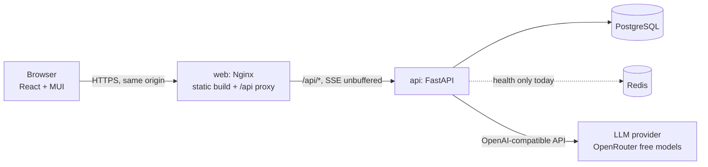
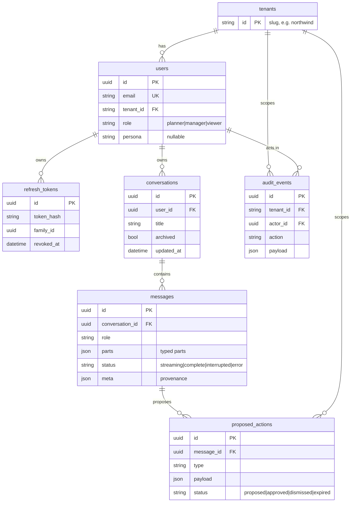
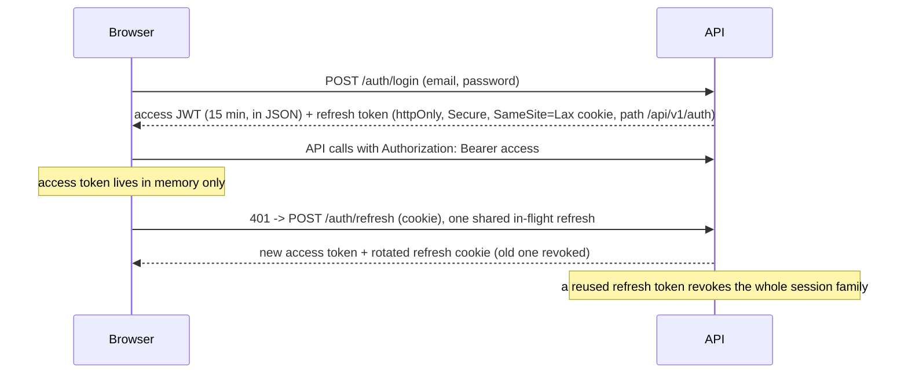

# Architecture and design decisions

This document explains how Tessera Chat is built and why. The README covers setup; `docs/PLAN.md` is the original
planning document (kept for history: where it disagrees with this file, this file is right).

## 1. What the system is

A ChatGPT-style web app with a layer for supply-chain planners (the "Supply Chain Copilot"):

- sign-up and login, per-user conversations that persist;
- answers that stream token by token;
- rich replies: Markdown with code highlighting, tables, charts, images, choice buttons, and proposal cards;
- two fictional companies (tenants) with their own data, personas, tools, approvals and audit log.

## 2. System context and deployment



- **One public origin.** The browser only talks to `web`. Nginx serves the React build and proxies `/api` to the API, so
  cookies are first-party and there is no CORS surface to get wrong. Buffering is off for the stream
  (`X-Accel-Buffering: no`, `proxy_buffering off`).
- **Railway** runs four services (web, api, Postgres, Redis); GitHub Actions deploys web and api on every merge to `main`.
- **Docker Compose** runs the same four pieces locally.
- **Migrations run when the API container starts** (`backend/scripts/start.sh`). If one fails, the container exits and the
  previous version keeps serving.

## 3. Backend

Layers, each testable on its own:

```
api/  (HTTP only: parse, validate, call a service, shape the response)
services/  (rules and transactions)
repositories/  (queries; every function takes the owner's id)
models/ + db/  (SQLAlchemy 2 async; Alembic migrations)
domain/  (copilot: scenario data, tools, personas, prompt)
llm/  (provider interface, OpenAI-compatible provider, mock, tool-markup filter)
```

Cross-cutting: one error shape for every non-2xx (`{error:{code,message,details,requestId}}`), a request id on every
response, `Cache-Control: no-store` on API responses, pure-ASGI middleware (so streaming is never buffered).

### Data model



Notable choices: UUID keys (not enumerable); CHECK constraints on enums; JSONB on Postgres and JSON elsewhere for
`parts`, `meta` and `payload`; a composite index `(user_id, updated_at)` serving the conversation list; python-side
timestamps (microsecond precision on every database).

### REST API (`/api/v1`)

| Method and path | Purpose |
|---|---|
| `POST /auth/register`, `/auth/login`, `/auth/refresh`, `/auth/logout` | Account and session lifecycle |
| `GET /me`, `PATCH /me/settings` | Current user; choose a persona |
| `GET /tenants` | The demo companies (public, for the sign-up form) |
| `GET /personas` | Personas for the caller's company |
| `GET/POST /conversations`, `GET/PATCH/DELETE /conversations/{id}` | Conversations (keyset pagination, search) |
| `GET /conversations/{id}/messages` | Saved messages |
| `POST /conversations/{id}/messages` | Send a message; the response is an SSE stream |
| `GET /actions/{id}`, `POST /actions/{id}/execute`, `POST /actions/{id}/dismiss` | Proposed actions |
| `GET /audit` | The caller's company's audit trail |
| `GET /health`, `GET /health/stream` | Health and an SSE smoke test |

### Streaming contract

`POST /conversations/{id}/messages` validates first (404, 409 and 422 are ordinary JSON errors, never a half-open
stream), then streams `event: start`, then any number of `token`, `part`, `tool`, and heartbeat comments, then exactly
one of `done` or `error`. The assistant row always ends in a terminal state: `complete`, `error` (partial text kept)
or `interrupted` (Stop or closed tab), written under a cancellation shield.

### Authentication and sessions



## 4. The Supply Chain Copilot

```mermaid
sequenceDiagram
    participant U as Planner
    participant S as ChatService
    participant L as LLM
    participant T as Tools (tenant-scoped)
    U->>S: question
    S->>L: history + company/persona prompt + this company's tool specs
    L-->>S: tool call (e.g. list_at_risk_shipments)
    S-->>U: event: tool running
    S->>T: validated arguments, caller's tenant
    T-->>S: facts + table/chart parts + provenance
    S-->>U: parts (table, chart) and event: tool done
    S->>L: tool result
    L-->>S: summary text (streamed to the user)
    Note over S: bounded loop; last round withholds tools
```

- **Tools** are typed (Pydantic, unknown arguments rejected), tenant-scoped (another company's tool looks exactly like a
  tool that does not exist), and return provenance: source, as-of time, confidence, assumptions. Data is fictional and
  deterministic.
- **Propose, then approve.** `propose_rebalance` only proposes. The server stores type and payload; the chat card holds
  only the action id. Approval checks tenant, then role, re-validates against current data, is idempotent and race-safe
  (one atomic `UPDATE ... WHERE status = 'proposed'`), writes one audit event, and expires after 30 minutes. The
  effect is simulated and labelled as such.
- **Why this answer** shows the tools, inputs, data as-of time, confidence and assumptions saved with the reply.

## 5. Frontend

React 18, TypeScript, Vite, MUI 6 with a custom theme (design tokens in `src/app/theme.ts`; the black navigation column
uses its own dark theme). Server state lives in TanStack Query (keys prefixed by user id, cache cleared on any identity
change); UI state stays in components. `useChat` holds the turn in flight and hands over to the saved copy when the
stream ends. Markdown, highlighting and charts are lazy-loaded.

## 6. Security summary

- Passwords: Argon2id, rehash on login; identical error and similar timing for unknown email and wrong password.
- Tokens: short-lived access JWT in memory; refresh token httpOnly, hashed in the database, rotated, reuse-detected.
- Ownership in every query; other users' ids are 404. Tenant and role come from the database row, never from the client.
- Model output is not trusted: structured parts are validated and unsafe ones dropped; table cells render as text;
  Markdown allows no raw HTML; images are https only.
- Secrets only in environment variables (Railway or a git-ignored `.env`); the app refuses to start without a JWT secret,
  or with the mock assistant in production.

## 7. Testing

| Layer | How |
|---|---|
| Backend | pytest on SQLite for speed (auth, ownership isolation per endpoint, streaming and terminal states, tools, actions, race conditions); an opt-in `live` marker for the real provider |
| Migrations | CI also runs `upgrade`, `downgrade`, `upgrade` on a real PostgreSQL service, plus a drift test |
| Frontend | Vitest and Testing Library with a controllable SSE response so streaming is tested incrementally |
| End to end | Playwright scripts were run against the live site at each slice (not committed as a suite) |

Several tests were mutation-checked (break the code, confirm the test fails), which twice exposed tests that could not fail.

## 8. Architecture decision records

**ADR-1: Server-Sent Events, not WebSockets.** Streaming is one-way; SSE is plain HTTP, works through proxies, and fits
`fetch`. Trade-off: no bidirectional channel; WebSockets are the upgrade if needed.

**ADR-2: Messages are lists of typed parts.** One representation serves streaming, history, copy and the tools. New part
types need no schema change. Trade-off: every part must be validated (it is, on both sides).

**ADR-3: Access token in memory, refresh token in an httpOnly cookie, with rotation.** XSS cannot read either; the refresh
token can be revoked and reuse is detected. Trade-off: a reload needs a silent refresh; a multi-tab race can log a user out.

**ADR-4: Keyset pagination for conversations.** Stable under writes, constant cost, uses the index. Trade-off: no jump to
page N.

**ADR-5: Ownership in the query, 404 for foreign ids.** No code path loads a row without saying whose it is, and ids are
not an oracle.

**ADR-6: An LLM provider interface and no silent fallback.** The service depends on a small interface; production fails at
startup without a key and refuses the mock, and empty replies are errors. A demo that quietly fakes answers is worse than
one that fails loudly. Retries use the same model only.

**ADR-7: Tool calling on the server, in a bounded loop.** The server runs tools, validates arguments, scopes them to the
tenant and records provenance; the model only writes words. Trade-off: free models are less reliable at tool calling, so
a streaming filter converts tool calls written as text into real calls.

**ADR-8: Proposals are server-side records.** Buttons carry ids, never instructions. Trade-off: one more table and an
expiry to manage.

**ADR-9: Tenant and role from the database.** Claims in a token can be stale and anything from the client is untrusted.
Trade-off: one lookup per request (already needed to load the user).

**ADR-10: SQLite for fast tests, real Postgres for migrations in CI.** Speed for the 350+ tests, truth for the schema.
Known difference: SQLite serialises writers, so race conditions are proven with forced interleavings, not just
concurrent requests.

**ADR-11: Migrate on container start.** Always in sync with the code and simple for one instance. Trade-off: with several
replicas, run migrations as a separate pre-deploy job.

**ADR-12: Same-origin deployment through Nginx.** First-party cookies, no CORS configuration, one public domain.

## 9. Assumptions and limitations

- A demo, not a service: do not use real passwords. The sign-up form lets you pick the demo company; real products assign
  tenants by invitation or SSO. Roles cannot be chosen at sign-up (everyone is a planner).
- The supply-chain data is fictional and static. Approving an action is simulated; nothing real is changed.
- The assistant uses free OpenRouter models: they can be slow, rate-limited (the API retries the same model, and the
  UI has a Retry button), or less reliable at tool calling than paid models.
- Not built: rate limiting on login and messages, email verification and password reset, dark mode, conversation export,
  a Redis cache (Redis is provisioned and health-checked, but nothing is cached yet), full-text search (search is by title),
  message editing or regeneration, audit-log filters and pagination.
- Approvals are company-wide: any planner can approve another planner's proposal.
- CSRF protection is the baseline (SameSite=Lax cookie, same-origin deployment), without a token.
- With multiple API replicas, migrations on start could race (see ADR-11).

## 10. What I would do next

1. Rate limiting for login and messages (Redis sliding window) and a Redis cache for the conversation list.
2. Dark mode, conversation export, search across message text (Postgres trigram or full text).
3. A committed Playwright suite for the main journeys, including the account-switch case.
4. Structured logging, metrics and tracing; per-tenant usage limits.
5. Real connectors behind the tools, with the action table acting as an outbox with retries.
6. Message regeneration and editing, resumable streams.
