# ChatGPT Clone: Plan, HLD and LLD

Assignment: full stack ChatGPT clone, **48 hours**, public GitHub repo. See `docs/assignment.pdf`.
Owner: Naresh Ghanate. Agents: BMAD (installed in `_bmad/`, skills in `.claude/skills/`).

> **Deployment:** everything on **Railway** (Section 14); no Vercel.
>
> **Real LLM:** the Poe API is the default LLM backend (**Section 13**; it supersedes any "mock by default" wording below). Keep the key in `.env` only.
>
> **Blue Yonder customization:** see **Section 12** (Supply Chain Copilot domain pack: personas, tool-calling over fictional data, approval + audit, tenant scoping). Section 12.8 supersedes the S4-S8 rows in Section 5.

---

## 1. Scope

### Must have (core)
| # | Requirement | Where it lives |
|---|---|---|
| C1 | Conversational chat: messaging, conversations, users, settings | API + UI |
| C2 | RESTful API for chat operations | FastAPI |
| C3 | React state management and Material UI theming | Web |
| C4 | Authentication and persistence | JWT + PostgreSQL |
| C5 | Message streaming (tokens as generated) | SSE |
| C6 | Rich content: images, tables, lists | Message parts + Markdown |
| C7 | Action buttons / choice menus | `actions` message part |

### Bonus (chosen)
- **Backend:** Docker Compose, Alembic migrations, Redis caching and rate limiting.
- **Frontend:** dark mode, Markdown rendering, code syntax highlighting, copy message, conversation search/filter, export conversation, charts (Recharts, as a `chart` message part).

### Out of scope (document as "if given more time")
File uploads, message editing/regeneration, resumable streams, multi-tenant orgs, SSO, observability stack, CI pipeline.

### Evaluation map
| Criterion | How we address it |
|---|---|
| Code quality | Layered backend, typed frontend, linters, small commits |
| Coding agent | BMAD agents, `CLAUDE.md`, plan-first workflow, README section on agent use |
| Architecture | Section 3 HLD, ADRs in section 7 |
| Functionality | All core items plus the chosen bonuses |
| Security | Section 6 |
| API design | REST resources, consistent errors, pagination, OpenAPI docs |
| Database design | Section 4.3 ER model, indexes, Alembic |
| Documentation | README, this plan, ADRs, assumptions and limits |
| UX | MUI theme, responsive layout, loading and error states |

---

## 2. Stack

| Layer | Choice | Reason |
|---|---|---|
| Backend | Python 3.12, FastAPI, SQLAlchemy 2 (async), Pydantic v2 | Matches target stack; async streaming |
| DB | PostgreSQL 16 + Alembic | Relational model, migrations bonus |
| Cache | Redis 7 | Conversation-list cache, rate limiting |
| Frontend | React 18, TypeScript, Vite, Material UI v6 | MUI theming required |
| Client state | TanStack Query (server state) + Zustand (UI state) | Clear split of concerns |
| Streaming | Server-Sent Events over `fetch` streaming | One-way token stream, simple |
| Rendering | react-markdown, remark-gfm, rehype-highlight, Recharts | Markdown, tables, code, charts |
| Auth | Argon2 password hashing, JWT access token + httpOnly refresh cookie | Standard, secure |
| LLM | `LLMProvider` interface: **`PoeProvider` (OpenAI SDK, Poe API) as default** + `MockProvider` fallback | Real answers with your Poe key; reviewers without a key still run demo mode (see section 13) |
| Packaging | Docker Compose (web, api, db, redis) | One command to run |
| Tests | pytest + httpx, Vitest + React Testing Library, Playwright smoke (optional) | Quality evidence |

---

## 3. High-Level Design (HLD)

### 3.1 System context
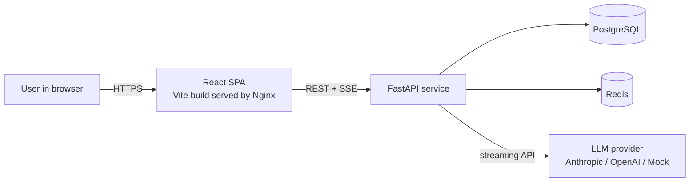

### 3.2 Container / deployment view
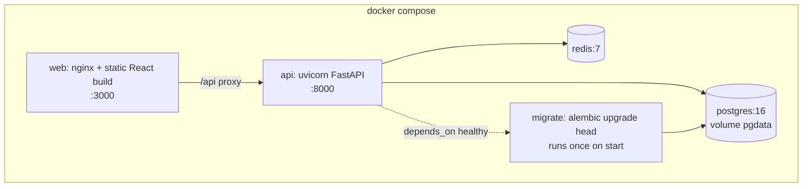

### 3.3 Backend layered architecture
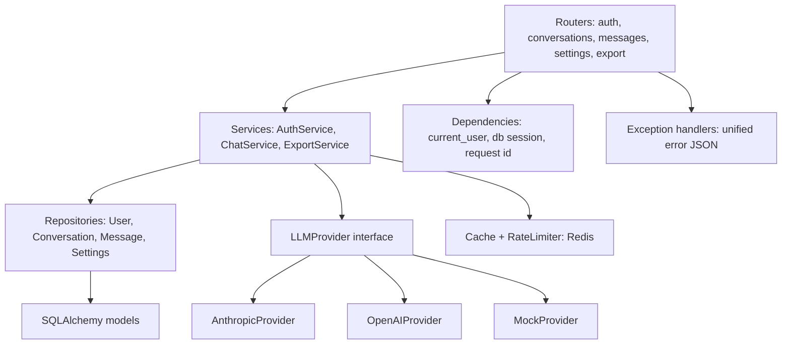

### 3.4 Chat streaming (main flow)
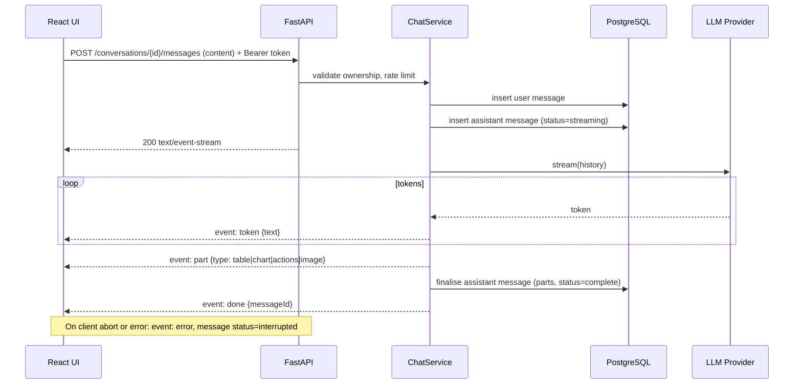

### 3.5 Authentication flow
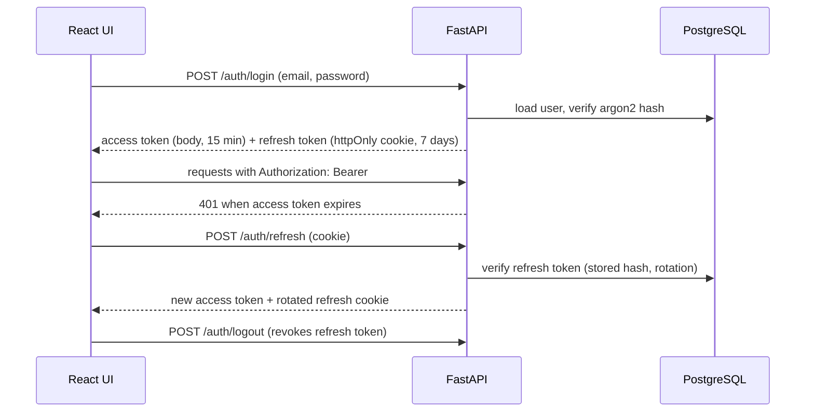

### 3.6 Non-functional targets
- First token under 1 second with `MockProvider`; UI stays responsive during long streams.
- All data scoped to the owning user; no cross-user reads.
- One-command start (`docker compose up`) and a documented local dev path.
- Clean teardown: no secrets in the repo, `.env.example` provided.

---

## 4. Low-Level Design (LLD)

### 4.1 Repository layout
```
chatgpt-clone/
  README.md  docs/ (PLAN.md, ARCHITECTURE.md, ADRs, assignment.pdf)
  docker-compose.yml  .env.example  CLAUDE.md
  backend/
    app/
      main.py  config.py  deps.py  errors.py  security.py
      api/ (auth.py conversations.py messages.py settings.py export.py)
      services/ (auth_service.py chat_service.py export_service.py rate_limit.py)
      repositories/ (users.py conversations.py messages.py settings.py)
      models/ (user.py conversation.py message.py settings.py base.py)
      schemas/ (auth.py conversation.py message.py settings.py common.py)
      llm/ (base.py anthropic_provider.py openai_provider.py mock_provider.py parts.py)
    alembic/  tests/  pyproject.toml  Dockerfile
  frontend/
    src/
      app/ (App.tsx routes.tsx theme.ts queryClient.ts)
      features/ (auth/ chat/ conversations/ settings/)
      components/ (Message/ MarkdownView/ ChartPart/ ActionBar/ Composer/ Sidebar/)
      hooks/ (useStream.ts useAuth.ts)
      api/ (client.ts types.ts)
      store/ (ui.ts)
    package.json  vite.config.ts  Dockerfile  nginx.conf
```

### 4.2 Message parts model (rich content and actions)
An assistant message is a list of typed **parts**. Plain text streams as `token` events; structured parts arrive as `part` events and are stored as JSON.

| Part type | Payload | Rendered as |
|---|---|---|
| `text` | `{ markdown: string }` | react-markdown (lists, code, tables via GFM) |
| `table` | `{ columns: string[], rows: any[][] }` | MUI Table |
| `chart` | `{ kind: "bar" or "line", series: [...] }` | Recharts |
| `image` | `{ url: string, alt: string }` | `` with lazy load |
| `actions` | `{ prompt: string, options: [{ id, label, value }] }` | Chips / choice menu; click posts `value` as next user message |

### 4.3 Data model
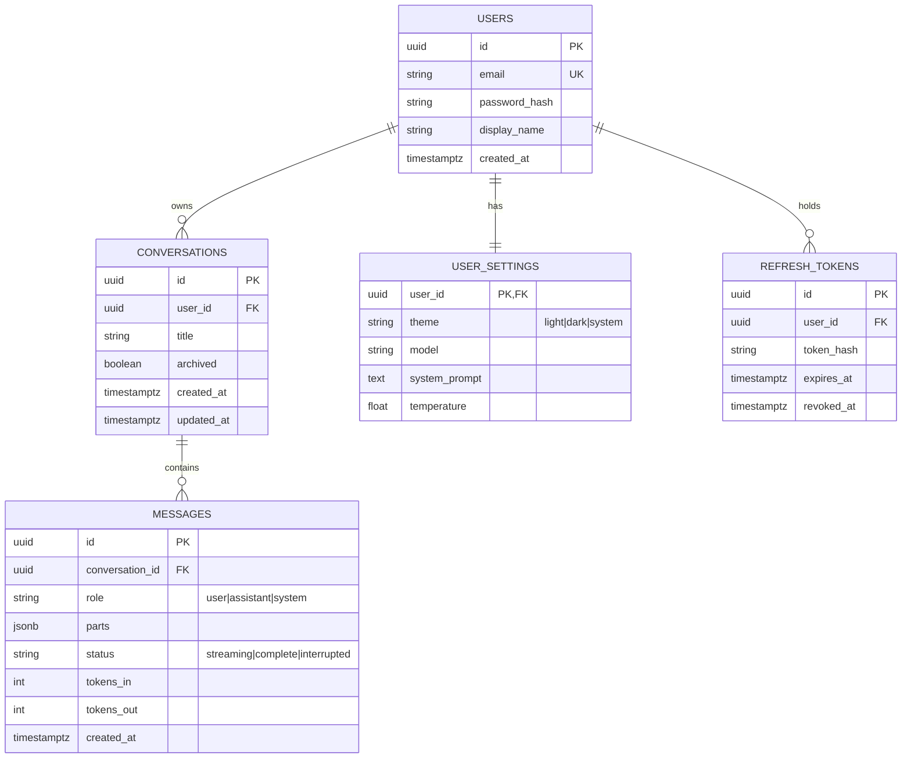
Indexes: `conversations(user_id, updated_at desc)`, `messages(conversation_id, created_at)`, `users(email)` unique, GIN/trigram on `conversations.title` and message text for search.

### 4.4 REST API
Base path `/api/v1`. All JSON unless noted. Auth required except register/login/refresh.

| Method | Path | Purpose | Notes |
|---|---|---|---|
| POST | `/auth/register` | Create user | 201; password rules; unique email |
| POST | `/auth/login` | Login | Access token in body, refresh cookie |
| POST | `/auth/refresh` | Rotate tokens | Cookie based |
| POST | `/auth/logout` | Revoke refresh token | 204 |
| GET | `/me` | Current user | |
| GET | `/conversations` | List, `?q=` search, `?cursor=&limit=` | Cached per user in Redis |
| POST | `/conversations` | Create | 201 |
| GET | `/conversations/{id}` | Detail with messages | Ownership check |
| PATCH | `/conversations/{id}` | Rename / archive | |
| DELETE | `/conversations/{id}` | Delete | 204 |
| POST | `/conversations/{id}/messages` | Send message, **SSE response** | Rate limited |
| GET | `/conversations/{id}/export?format=md\|json` | Export | File download |
| GET | `/settings` | Read settings | |
| PUT | `/settings` | Update settings | |
| GET | `/health` | Liveness and readiness | Used by Compose |

**Error shape (all non-2xx):**
```json
{ "error": { "code": "conversation_not_found", "message": "Conversation not found", "details": null, "requestId": "..." } }
```
Status mapping: 400 validation, 401 unauthenticated, 403 forbidden, 404 not found, 409 conflict, 422 schema error, 429 rate limited, 500 unexpected (no stack trace to the client).

### 4.5 SSE event contract
```
event: token   data: {"text": "Hel"}
event: part    data: {"type": "table", "payload": { ... }}
event: done    data: {"messageId": "uuid", "tokensOut": 123}
event: error   data: {"code": "llm_unavailable", "message": "..."}
```
Heartbeat comment every 15 seconds. Client closes the stream on `done`/`error`; on abort the server marks the message `interrupted`.

### 4.6 Key backend classes and responsibilities
| Component | Responsibility |
|---|---|
| `AuthService` | Register, verify password (argon2), issue and rotate JWTs, revoke refresh tokens |
| `ChatService` | Ownership checks, persist messages, build history window, drive the provider stream, assemble parts |
| `LLMProvider` (protocol) | `stream(messages, settings) -> AsyncIterator[Event]` |
| `MockProvider` | Deterministic streaming, including table, chart and actions parts so the UI is fully demoable offline |
| `RateLimiter` | Redis sliding window, per user and per IP on login |
| `ConversationRepo` | Queries scoped by `user_id`, keyset pagination, search |
| `ExportService` | Markdown and JSON exporters |

### 4.7 Frontend design
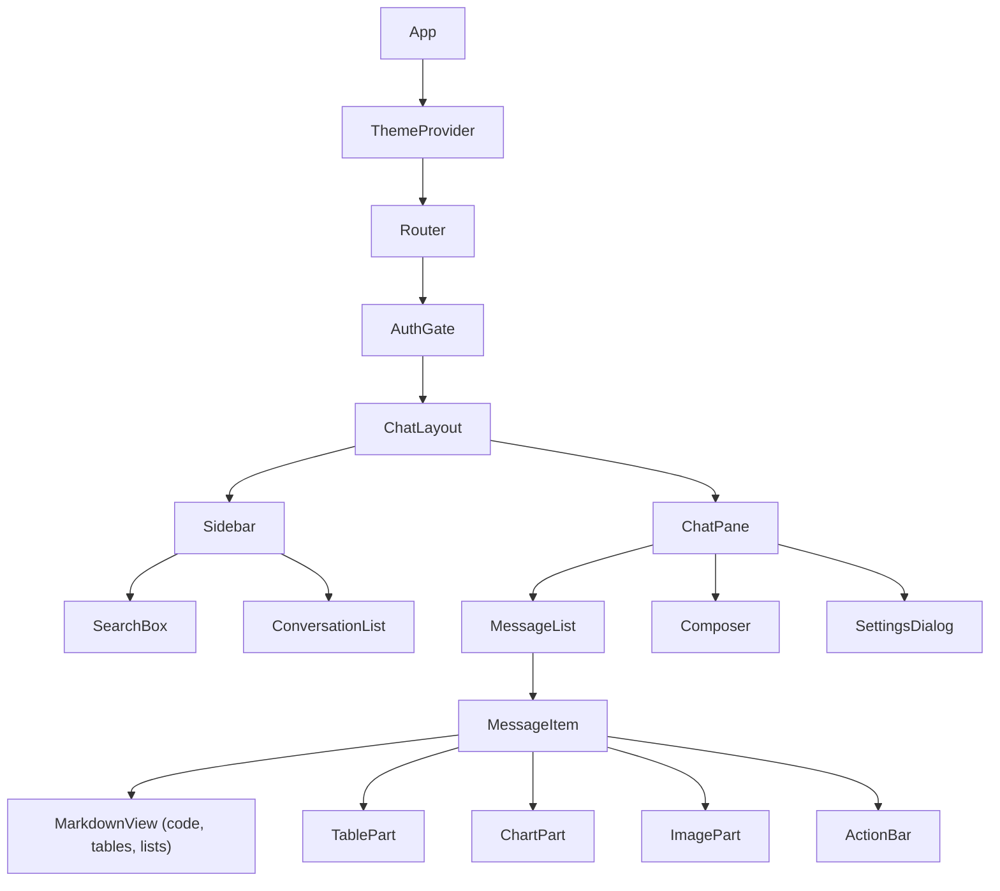
State split:
- **Server state (TanStack Query):** conversations, messages, settings, with cache invalidation after mutations.
- **UI state (Zustand):** sidebar open, theme mode, composer draft, active stream status.
- **Streaming hook (`useStream`):** `fetch` + `ReadableStream` parser for SSE, appends tokens to an optimistic assistant message, supports Stop (AbortController), reconciles with the server copy on `done`.
- **Theming:** `createTheme` with light and dark palettes from design tokens, persisted in settings and `localStorage`.
- **Accessibility and UX:** keyboard send (Enter / Shift+Enter), focus management, auto-scroll with "jump to latest", skeletons, error toasts, responsive drawer on mobile.

### 4.8 Caching strategy
- `GET /conversations` cached in Redis per user (30 s TTL) and invalidated on create/rename/delete/new message.
- Rate limiting counters in Redis (login 10/min per IP, messages 30/min per user).
- Cache failures never break requests (fail open, logged).

### 4.9 Testing strategy
- **Backend (pytest):** auth lifecycle, ownership isolation (user A cannot read user B), message streaming contract with `MockProvider`, error shapes, rate limiting, migrations apply on empty DB.
- **Frontend (Vitest/RTL):** `useStream` parser, MessageItem part rendering, theme toggle, ActionBar posts the chosen option.
- **Smoke:** Playwright (optional) for register, chat, stream, search, export.
- Run all in a `make test` target and document it.

---

## 5. Milestones (48 hours, vertical slices)

| Slice | Hours | Deliverable | Done when |
|---|---|---|---|
| S0 Foundation | 0-3 | Repo, Compose, FastAPI + React skeletons, CI-less lint config, `CLAUDE.md`, BMAD planning docs | `docker compose up` shows health OK |
| S1 Auth | 3-8 | Models, Alembic, register/login/refresh/logout, UI login | Can register and log in; ownership tests green |
| S2 Conversations | 8-12 | CRUD, list, search, UI sidebar | Create, rename, delete in UI |
| S3 Streaming chat | 12-20 | SSE endpoint, MockProvider, `useStream`, message list | Tokens stream live; stop works |
| S4 Rich parts and actions | 20-28 | Table, chart, image, action buttons, Markdown + code highlight | Demo prompt renders every part type |
| S5 Real LLM and settings | 28-32 | Provider adapter, settings dialog, system prompt, model | Works with a real key; mock still default |
| S6 Bonuses | 32-38 | Dark mode, copy, export, Redis cache, rate limit | Each bonus demoed |
| S7 Hardening and docs | 38-45 | Error states, responsive polish, README, architecture notes, ADRs, screenshots | Fresh clone runs from README |
| S8 Submit | 45-48 | Fresh-clone test, tag, public repo, recording | Link sent with buffer |

Rules: cut scope before cutting tests or docs; if behind at hour 28, drop charts and export first.

---

## 6. Security checklist
- Argon2id password hashing; minimum password policy; generic login error messages.
- Short-lived access token, rotating refresh token stored hashed, httpOnly + SameSite=Lax (+ Secure in production) cookie; logout revokes.
- Every query scoped by `user_id`; ownership tests.
- Input validation via Pydantic; output escaping; Markdown rendered without raw HTML (`rehype-sanitize`).
- CORS restricted to configured origins; security headers via Nginx (CSP, X-Content-Type-Options, frame options).
- Rate limiting on login and messages; request size limits.
- Secrets only via environment; `.env.example` committed, `.env` ignored; no stack traces to clients.
- Dependency pinning and `pip-audit` / `npm audit` noted in README.

---

## 7. Architecture decisions (ADR summary)
| ID | Decision | Alternatives | Why |
|---|---|---|---|
| ADR-1 | SSE for streaming | WebSockets | One-way stream, simpler infra, proxies friendly; document upgrade path |
| ADR-2 | Messages as typed JSON parts | Plain text / Markdown only | Enables tables, charts, actions without parsing hacks |
| ADR-3 | JWT access + rotating httpOnly refresh | Session cookies; localStorage tokens | Avoids token theft via XSS; stateless API |
| ADR-4 | PostgreSQL + Alembic | SQLite | Concurrency, JSONB, search, realistic migrations |
| ADR-5 | Poe API as real LLM; MockProvider as fallback only | Mock-only; direct vendor SDK | Real behavior as requested; OpenAI-compatible so swapping providers is config; mock keeps tests, CI and no-key reviewers working (section 13) |
| ADR-6 | TanStack Query + Zustand | Redux | Less boilerplate; clear server vs UI state split |
| ADR-7 | Redis for cache and rate limit | In-memory | Works across workers; satisfies caching bonus |

---

## 8. Assumptions and limitations (copy into README)
- Single-region, single-tenant demo; no email verification or password reset.
- Streaming resumes are not supported; interrupted messages are marked as such.
- Image parts reference URLs; no uploads in this version.
- LLM cost controls are minimal (history window cap only).

---

## 9. Follow-up call prep
**Trade-offs:** SSE vs WebSockets; JSON parts vs text; cookie vs header tokens; Postgres vs SQLite; mock vs real LLM.
**Challenges to be ready to tell:** SSE parsing over `fetch`, optimistic message reconciliation, partial-save on abort, ownership scoping in every query.
**If given more time:** attachments, edit and regenerate, resumable streams (Last-Event-ID), WebSockets for presence, evals for responses, OpenTelemetry tracing, CI/CD, multi-tenant.

---

## 10. BMAD workflow for this project

BMAD is installed in `_bmad/` with skills in `.claude/skills/`. Start your coding agent **from this folder**.

| Step | Invoke (skill) | Agent / persona | Output |
|---|---|---|---|
| 0 | `bmad-help` | n/a | Tells you the next step at any time |
| 1 | `bmad-product-brief` | Mary (analyst), `bmad-agent-analyst` | Product brief in `_bmad-output/` (feed it Section 1 of this plan) |
| 2 | `bmad-prd` | John (PM), `bmad-agent-pm` | PRD with requirements C1-C7 and bonuses |
| 3 | `bmad-ux` | Sally (UX), `bmad-agent-ux-designer` | DESIGN.md (look) and EXPERIENCE.md (behavior) |
| 4 | `bmad-architecture` | Winston (architect), `bmad-agent-architect` | Architecture doc; seed it with Sections 3-4 and 7 |
| 5 | `bmad-create-epics-and-stories` | n/a | Epics/stories mapped to slices S1-S8 |
| 6 | `bmad-sprint-planning` | n/a | Sprint status file |
| 7 | `bmad-build` (or `bmad-agent-dev`, Amelia) | Developer | Implements one story at a time with tests |
| 8 | `bmad-code-review` | n/a | Parallel review per slice |
| 9 | `bmad-qa-generate-e2e-tests` | n/a | API and E2E tests |

Tips:
- Time-box planning to about 2 hours: the artifacts above already contain most decisions, so tell each agent "use `docs/PLAN.md` as the source of truth, challenge it only where it is wrong".
- Use `bmad-party-mode` once (architect + dev + UX) to stress-test the design before building.
- Commit after every story with a clear message; the history shows how you used the agents (this is graded).
- Add a README section "How I used coding agents": which BMAD skills, what you reviewed or corrected by hand.
- Run `bmad-project-context` after the skeleton exists so agents get repo conventions.

---

## 11. Submission checklist
- [ ] Public GitHub repo, clean history, MIT licence optional
- [ ] README: overview, features, architecture diagram, setup (Docker and local), environment variables, test commands
- [ ] `.env.example`, no secrets committed
- [ ] `docs/ARCHITECTURE.md` and ADRs (from sections 3, 4, 7)
- [ ] Assumptions and limitations documented
- [ ] Screenshots or short screen recording
- [ ] Optional live demo link
- [ ] Fresh-clone test: `git clone`, `docker compose up`, register, chat, stream, search, export
- [ ] "How I used coding agents" section


---

## 12. Blue Yonder customization: the "Supply Chain Copilot" domain pack

**Principle:** the core stays a faithful ChatGPT clone (everything in sections 1-11). The domain pack is a **thin, optional layer** on top: personas, domain tools over fictional data, and trust features. Budget about 6 hours. If the schedule slips, cut the pack, not the core.

**Context (from the Blue Yonder fact sheet and JD):** Blue Yonder is "the AI company for supply chain", serving 3,000+ retailers, manufacturers and logistics providers, with leadership positions in planning, transportation and warehouse management. The role is architecting a **cloud-native GenAI/UX platform** with secure multi-tenant microservices, and AI agents are a plus. We use **generic, fictional data and our own naming** ("Supply Chain Copilot"): no Blue Yonder logos, product names or customer data.

### 12.1 Who the users are (customer perspective)
| Persona | Daily reality | What they ask the copilot |
|---|---|---|
| **Demand planner** (retail / CPG) | Forecast accuracy, promotions, stock-outs | "Which SKUs are forecast to stock out next 2 weeks?", "Why did forecast change for SKU X?" |
| **DC / warehouse manager** | Inventory, labor, dock capacity | "Where do I have excess inventory I can move?", "Which inbound loads need dock slots tomorrow?" |
| **Transportation / logistics planner** (LSP) | ETAs, delays, cost and carbon per lane | "Which shipments are at risk of missing SLA?", "Show me cost and carbon for rerouting lane A to B" |

### 12.2 What good looks like for them (design drivers)
1. **Exceptions first.** Planners manage by exception: the copilot leads with what needs attention, then offers detail.
2. **Trust and explainability.** Enterprise users will not act on unexplained numbers. Every answer shows **sources, assumptions and confidence**, and numbers come **only from tools**, never invented by the model.
3. **Decisions, not just answers.** Responses end with **action buttons** (for example "Rebalance 400 units DC-2 to DC-5") that need an **explicit human approval** and write an **audit event**.
4. **Speed.** Starter prompts per persona, streaming answers, and tables and charts instead of prose walls.
5. **Safe by default.** Role-based visibility, tenant isolation, no cross-customer data, audit trail for every action.
6. **Sustainability.** Cost and carbon side by side for transport decisions (matches Blue Yonder's published carbon-reporting direction).

### 12.3 Features (all map onto the existing message-parts model)
| Feature | Built on | Demo moment |
|---|---|---|
| **Persona switcher** (settings): sets system prompt, starter prompts, default views | `user_settings.persona` | Switch persona, starter chips change |
| **Domain tools** over fictional data: `get_demand_forecast`, `get_inventory_position`, `list_at_risk_shipments`, `propose_rebalance`, `get_lane_cost_carbon` | Tool-calling in `ChatService` | Ask a question, watch "Calling tool..." then results |
| **Rich results**: forecast-vs-actual `chart`, at-risk shipments `table`, KPI strip | Existing `chart` / `table` parts | Answer renders a chart and a table |
| **Approval actions**: `actions` part with Approve / Dismiss / Ask why | `actions` part + `POST /actions/{id}/execute` | Click Approve, see confirmation and audit entry |
| **Why this answer** drawer: tools called, inputs, data timestamps, confidence | `message.meta.provenance` | Open drawer under any answer |
| **Audit log view** (read-only): who approved what and when | `audit_events` table | Show the trail |
| **Tenant scoping**: every row carries `tenant_id`; demo has two fictional tenants | `tenant_id` on core tables + request context | Log in as tenant A, cannot see tenant B |

**Not building (state as roadmap):** real integrations (ERP/WMS/TMS), real forecasting models, optimization solvers, SSO, per-field permissions.

### 12.4 Architecture additions

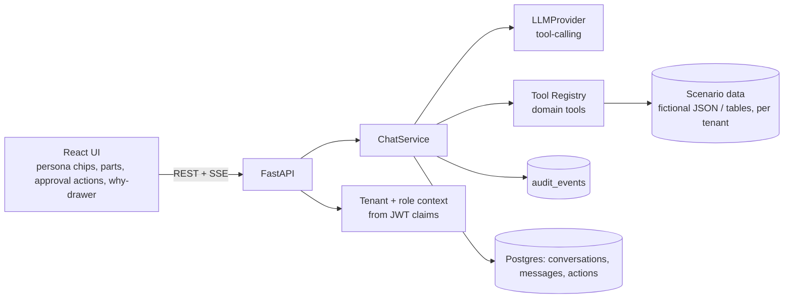

**Tool-calling flow with human approval:**
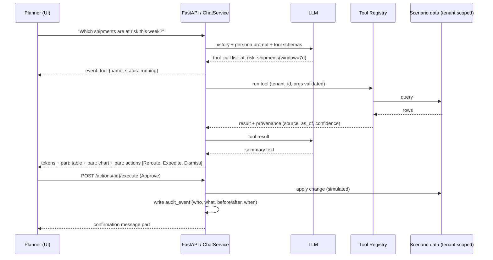

### 12.5 Data model additions
| Table / column | Purpose |
|---|---|
| `tenants(id, name)` | Fictional customers: for example a grocery retailer and a regional logistics provider |
| `users.tenant_id`, `users.role` | `planner`, `manager`, `viewer`; role gates action execution |
| `conversations.tenant_id`, `messages.tenant_id` | Defence in depth for isolation |
| `user_settings.persona` | `demand_planner`, `dc_manager`, `transport_planner` |
| `scenario_*` tables or JSON fixtures | `sku`, `location`, `inventory`, `forecast_point`, `shipment` (all seeded, fictional) |
| `proposed_actions(id, message_id, type, payload, status, expires_at)` | Action buttons are server-side records, not trusted client payloads |
| `audit_events(id, tenant_id, actor_id, action, payload, created_at)` | Append-only |
| `messages.meta` (jsonb) | `provenance`: tools called, args, data `as_of`, confidence |

### 12.6 API additions
| Method | Path | Purpose |
|---|---|---|
| GET | `/personas` | Persona list with system prompts and starter prompts |
| GET | `/tools` | Registered tools (names, schemas) for the why-drawer |
| POST | `/actions/{id}/execute` | Approve a proposed action (role + tenant checked, idempotent) |
| POST | `/actions/{id}/dismiss` | Dismiss |
| GET | `/audit` | Tenant-scoped audit log, paginated |

SSE adds one event: `event: tool  data: {"name": "...", "status": "running|done|error"}`.

### 12.7 Trust and safety rules for the copilot (put in the system prompt and tests)
- Quote numbers only from tool results; if no tool covers the question, say so and suggest what data is needed.
- Always state the data `as_of` time and any assumption.
- Never execute an action without an approval event from the user; actions are proposed, not performed.
- Refuse or redirect questions outside the tenant's data scope.
- Add tests: tool arguments are validated, cross-tenant access returns 404, action execution is idempotent and audited, the `MockProvider` path exercises tool calling deterministically.

### 12.8 Schedule impact (replaces the S4-S6 rows in section 5)
| Slice | Hours | Change |
|---|---|---|
| S4 Rich parts and actions | 20-26 | Same as before, plus server-side `proposed_actions` |
| **S5 Domain pack** | 26-34 | Personas, tool registry with 4-5 tools, scenario seed, why-drawer, approval + audit, tenant scoping |
| S6 Real LLM and settings | 34-37 | Adapter with tool-calling, persona in settings |
| S7 Bonuses (trimmed) | 37-41 | Dark mode, copy, search, Redis cache. **Drop: export, rate limit polish** if behind |
| S8 Hardening and docs | 41-46 | README, ADRs, screenshots, fresh-clone test |
| S9 Submit | 46-48 | Buffer |

### 12.9 Positioning in the README and on the call
- **Framing:** "A ChatGPT-style app, plus an optional Supply Chain Copilot pack that shows how I would build trustworthy, tool-using GenAI for planners: exception-first answers, provenance, human approval and audit."
- **Customer story to tell:** a transport planner sees three at-risk shipments, compares cost and carbon for rerouting, approves one action, and the audit trail records it, all in one conversation.
- **Why it maps to the role:** tool-calling agents, event-driven and multi-tenant thinking, security, and UX for enterprise users, with architecture decisions you can defend.
- **Be honest about limits:** data is fictional and the tools are simulated; real value needs ERP/WMS/TMS integrations and real forecast models.
- **Questions to ask them:** which personas matter most, how they handle LLM guardrails and tenant isolation today, and whether Azure Foundry is the intended runtime.

### 12.10 Updates for the BMAD steps
- **Product brief / PRD:** include the three personas, jobs-to-be-done and the trust principles in 12.2 as requirements.
- **UX (`bmad-ux`):** provide persona starter prompts, the exception-first answer layout, and the why-drawer behavior.
- **Architecture (`bmad-architecture`):** include tenant scoping, the tool registry and the approval flow.
- **Stories:** one epic per feature in 12.3, each with acceptance tests from 12.7.


---

## 13. Real LLM via the Poe API (supersedes the "mock by default" assumption)

**Decision:** use the **Poe API** as the real LLM backend. `MockProvider` stays, but only as a **fallback for tests, CI and reviewers without a key**. Verified from Poe's docs (`creator.poe.com/docs/external-applications/openai-compatible-api`).

### 13.1 What Poe gives us
| Capability | Detail | Impact on design |
|---|---|---|
| Endpoint | OpenAI-compatible, base URL `https://api.poe.com/v1`, `Authorization: Bearer <POE_API_KEY>` | Use the official `openai` Python SDK with `base_url`; no custom HTTP client |
| APIs | Chat Completions (`/v1/chat/completions`) and Responses (`/v1/responses`) | Use Chat Completions (simplest, widest support) |
| Streaming | Supported (`stream=True`) | Maps directly onto our SSE `token` events |
| Tool / function calling | Supported, **but `strict` is ignored** (tool JSON may not match the schema) | **Validate tool arguments with Pydantic on the server**; return a tool error to the model on invalid args |
| Models | Poe bot names (examples in docs: `Claude-Opus-4.7`, `GPT-5.4`, `Gemini-3.1-Pro`) | `POE_MODEL` is configuration; list available models at start-up if the endpoint allows, otherwise document the default |
| Rate limit | 500 requests per minute, request-based only | Still keep our own per-user limit; handle 429 with retry/backoff |
| Limits | `n` must be 1; **no JSON-schema structured outputs**; private bots unavailable | Do **not** ask the model to emit our message-parts JSON. Parts (table, chart, actions) are **built server-side from tool results** |

### 13.2 Provider design
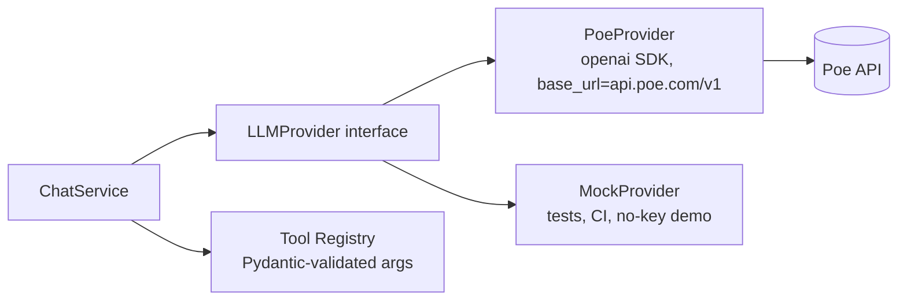
- `LLMProvider.stream(messages, tools, settings)` yields normalized events: `text_delta`, `tool_call`, `usage`, `error`.
- `PoeProvider` converts Chat Completions stream chunks into those events and accumulates partial `tool_calls` deltas until complete.
- `ChatService` runs the **tool loop**: model asks for a tool, server validates args, runs the tool (tenant scoped), appends the result, calls the model again, up to a small cap (for example 4 rounds) to prevent loops.
- Provider chosen by config: `LLM_PROVIDER=poe|mock`. If `POE_API_KEY` is missing, start in `mock` mode and show a banner ("Demo mode: no LLM key configured") instead of failing.

### 13.3 Configuration (`.env.example`, committed; `.env` ignored)
```
LLM_PROVIDER=poe
POE_API_KEY=
POE_BASE_URL=https://api.poe.com/v1
POE_MODEL=Claude-Opus-4.7        # example from Poe docs; any Poe bot name that supports tools
LLM_MAX_TOOL_ROUNDS=4
LLM_REQUEST_TIMEOUT_S=60
```

### 13.4 Error handling and resilience
- Timeouts and upstream 5xx: one retry with backoff, then SSE `event: error` with code `llm_unavailable` and message status `interrupted`.
- Upstream 429: retry honoring `x-ratelimit-reset-requests`; surface a friendly message if it persists.
- Model rejects tools or returns malformed tool JSON: return a tool error to the model once, then fall back to a plain answer.
- Never log prompts with user data or the API key; log request ids, model, latency and token counts only.

### 13.5 Key handling (important)
- **Never commit the key.** It lives only in `.env` (git-ignored) and in your deployment's secret store.
- **Do not paste the key into the chat or any issue.** Put it in `.env` yourself; if you want the agent to read it, reference the variable name, not the value.
- **The public repo cannot contain it**, so reviewers will not have your key: the README must say "set `POE_API_KEY` for real answers; without it the app runs in demo mode with the mock provider".
- **If you deploy a live demo with your key:** cap spend and abuse risk (per-user and per-IP rate limits, a short max output length, a modest model, low `max_tool_rounds`, no anonymous access) and **rotate or revoke the key after the review**.
- Check Poe's terms for API use limits before sharing a hosted demo.

### 13.6 Testing with a real provider
- Unit and CI tests use `MockProvider` (deterministic, free).
- Add one **opt-in** integration test (`pytest -m live`) that calls Poe with a tiny prompt and one tool, skipped when no key is present.
- Manually test: streaming, stop button mid-stream, tool call round trip, invalid tool args, 429 handling, long answers.

### 13.7 Schedule changes
- **S0 Foundation (0-3h):** add `.env.example`, config loading, `openai` dependency.
- **S3 Streaming chat (12-20h):** build against the `LLMProvider` interface with `MockProvider` first, then add `PoeProvider` the same day (about 2h) so streaming is validated end to end early.
- **S5 Domain pack:** tool-calling goes through `PoeProvider`; budget extra time for model-specific tool-call quirks (test two models, keep the better one as default).
- **S6:** replaced by "provider hardening" (retries, timeouts, errors, model setting in UI); the real-key work is no longer a late add-on.

### 13.8 Talking points
- Why an OpenAI-compatible adapter: swapping Poe for Azure OpenAI or another provider is a config change, relevant to Blue Yonder's Azure environment.
- Why server-built parts: models do not reliably produce structured output through this API, and tool results are the trustworthy source of numbers.
- How cost and abuse are controlled.
- What you would add: response evaluation, prompt versioning, caching of repeated tool calls, and provider failover.


---

## 14. Deployment: everything on Railway (no Vercel)

**Decision (ADR-8):** deploy the whole system on **Railway** in one project: `web`, `api`, `postgres`, `redis`. Same origin for the browser (Nginx in `web` proxies `/api` to `api` over Railway's private network), so cookies and SSE behave exactly like local Docker Compose. Vercel is not needed.

### 14.1 Topology
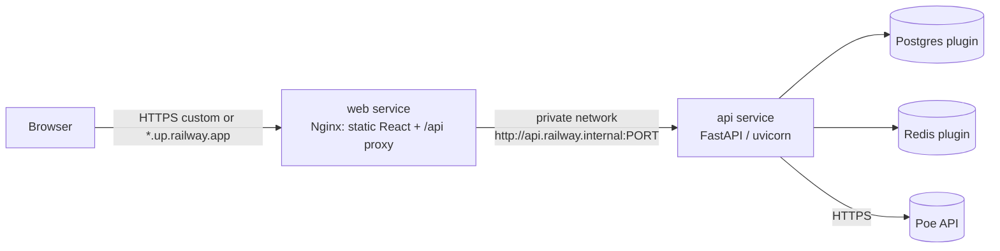
- Only `web` gets a public domain. `api`, Postgres and Redis stay private.
- Migrations run on each deploy (pre-deploy step) before the new `api` version takes traffic.

### 14.2 You do this once (account and project): I cannot do it for you
1. Sign up at railway.com with your own GitHub login (new account is fine) and verify email.
2. Plan: start on Trial/Hobby. From Railway's published plans: Free is $1 credit/month, Trial is a one-time $5 grant, **Hobby is $5/month with $5 usage included**. Postgres + Redis + two services running continuously will exceed free credit, so use Hobby for the review window and cancel afterwards.
3. Push the repo to GitHub (public, as the assignment requires) and connect it in Railway: **New Project -> Deploy from GitHub repo**.
4. Add **PostgreSQL** and **Redis** (New -> Database).
5. Create two services from the same repo and set each service's **Root Directory**: `/backend` for `api`, `/frontend` for `web` (monorepo, isolated). Set **watch paths** so each redeploys only on its own changes.
6. Generate a public domain on `web` only (Settings -> Networking).

### 14.3 Service configuration
| Service | Root dir | Build | Start | Notes |
|---|---|---|---|---|
| `api` | `/backend` | Dockerfile | `uvicorn app.main:app --host 0.0.0.0 --port $PORT` | Healthcheck `/api/v1/health`; **pre-deploy:** `alembic upgrade head` |
| `web` | `/frontend` | Dockerfile (multi-stage: Vite build then Nginx) | Nginx | Nginx listens on `$PORT`; proxies `/api/` to `http://api.railway.internal:<api PORT>` with buffering **off** for SSE |
| Postgres | n/a | Railway plugin | n/a | Use the plugin's connection variables |
| Redis | n/a | Railway plugin | n/a | Use the plugin's connection variables |

Config-as-code (`railway.toml` per service) is optional; if used, check the key names in Railway's current docs, since I could not verify them. The UI settings above are enough.

### 14.4 Environment variables (set in Railway, never in git)
| Variable | Service | Value |
|---|---|---|
| `LLM_PROVIDER` | api | `poe` |
| `POE_API_KEY` | api | **your key, set only in Railway** |
| `POE_BASE_URL` | api | `https://api.poe.com/v1` |
| `POE_MODEL` | api | chosen Poe bot name that supports tools |
| `DATABASE_URL` | api | built from the Postgres plugin variables (async driver: `postgresql+asyncpg://...`) |
| `REDIS_URL` | api | from the Redis plugin |
| `JWT_SECRET` | api | long random string |
| `COOKIE_SECURE` | api | `true` |
| `CORS_ORIGINS` | api | the public `web` URL (same origin, so this is mostly a safeguard) |
| `API_UPSTREAM` | web | `http://api.railway.internal:<api PORT>` consumed by Nginx via envsubst |

Use Railway's variable references between services where possible (check the exact syntax in the dashboard), so credentials are never copied by hand.

### 14.5 Production-readiness checklist
- [ ] **SSE through Nginx:** `proxy_buffering off`, `proxy_http_version 1.1`, `proxy_read_timeout 300s`, `X-Accel-Buffering: no` header from the API, heartbeat comment every 15 s.
- [ ] **Nginx upstream on private network:** test that `api.railway.internal` resolves from the `web` container. If it does not, switch Nginx to a variable-based `proxy_pass` with a `resolver` entry; I could not verify IPv6/IPv4 behavior from the docs, so test early (hour 3, not hour 46).
- [ ] **Migrations:** pre-deploy `alembic upgrade head`; deploy fails loudly if a migration fails.
- [ ] **Cookies:** `Secure`, `HttpOnly`, `SameSite=Lax` (same origin, so no cross-site cookie problem).
- [ ] **Rate limits and cost caps** on `/messages` and `/auth/login`, plus max output length, since the Poe key is billable.
- [ ] **Seed data** (fictional tenants and demo users) via a one-off command, not in the image.
- [ ] **Health endpoints** and Railway healthcheck configured; `api` fails fast when DB is unreachable.
- [ ] **Logs:** structured, no prompts or keys.
- [ ] **Backups:** note that Hobby Postgres is for a demo only; export data if it matters.
- [ ] **After review:** rotate or revoke the Poe key, then pause or delete the Railway project.

### 14.6 Schedule additions
- **S0 (0-3h):** write the two Dockerfiles and `nginx.conf` template now; deploy the empty skeleton to Railway **in the first 3 hours** to prove the pipeline (health endpoint, DB connection, private-network proxy, SSE heartbeat).
- **After each slice:** push to `main`; Railway redeploys. Smoke-test the live URL, not just localhost.
- **S8:** final deploy from a clean `main`, run the fresh-clone checklist against the live URL, capture screenshots from production.

### 14.7 Talking points
- Why one platform and one origin: fewer moving parts, no cross-site cookie issues, SSE just works.
- Why private networking: only `web` is public; API and data stores are not exposed.
- What you would change for real production: managed secrets, WAF, autoscaling replicas with sticky or stateless streaming, observability (traces, metrics), blue/green deploys, and moving to Azure to match Blue Yonder's environment (the container setup carries over).

### 14.8 Verified on 2026-10-06 (skeleton deployed via Railway CLI)
- Project `chatgpt-clone` created in the Railway account the CLI was logged in with; services `api`, `web`, Postgres, Redis.
- `web` public URL serves the React page; `GET /api/v1/health` through Nginx returns `{"status":"ok","db":"ok","redis":"ok"}` (private network name `api.railway.internal` resolved with the entrypoint's resolver detection).
- SSE test `GET /api/v1/health/stream` streams one tick per second through Nginx and Railway (no buffering).
- `api` listens on the injected `PORT` (8080); `web` uses `API_UPSTREAM=http://${{api.RAILWAY_PRIVATE_DOMAIN}}:8080`.
- Local uploads via `railway up ./backend --path-as-root --service api` and `railway up ./frontend --path-as-root --service web`. Switch to GitHub autodeploy later with `railway service source connect --repo owner/repo --branch main --service api` (and `web`).
- Not yet done: migrations pre-deploy command, real secrets (`JWT_SECRET`, `POE_API_KEY`), cost caps.
